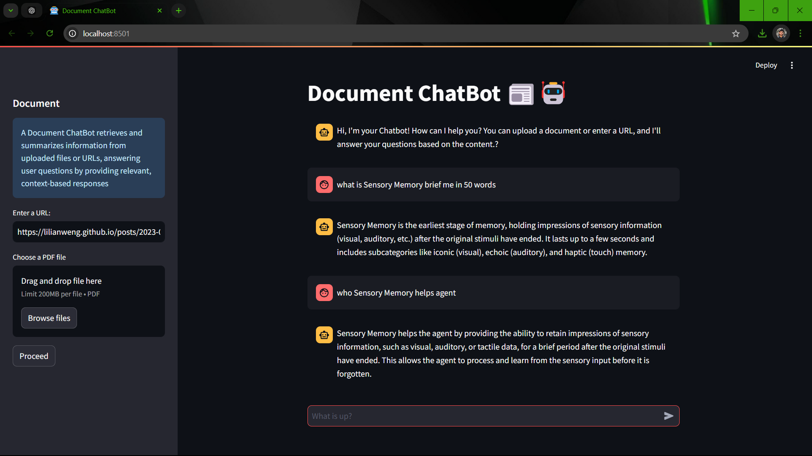

# Document ChatBot

 ### Conversational RAG
A Document ChatBot based on Conversational RAG(Retrieval-augmented generation) that retrieves and summarizes information from uploaded documents (PDF files or URLs). 
It provides concise, context-based answers to user questions by analyzing the contents of the uploaded files or web pages.

## Features

- **Document Retrieval**: Upload PDF files or provide URLs to retrieve content.
- **Conversational RAG**: Uses Retrieval-Augmented Generation to offer more accurate, context-aware answers.
- **Contextualized Question Reformulation**: Rephrases questions for standalone clarity, retaining chat history context.
- **Concise Responses**: Generates short, clear answers, using minimal text for easy readability.
- **Session Management**: Independently manages chat history and session data.

## Installation

To get started with the PDF Q&A System, follow these steps:

2.Clone the repository:
   ```bash
      git clone https://github.com/vishnun0027/Document-ChatBot.git
      cd Document-ChatBot
   ```
2.Install the required packages:
```bash
   pip install -r requirements.txt
```
3.Set up environment variables: Create a .env file in the root directory of the project and add your API keys:
```bash
   GROQ_API_KEY=your_groq_api_key
   HF_API_KEY=your_hugging_face_api_key
```

## Usage
1. Run the Streamlit application:

2. run app
```gash
   streamlit run bot.py
```


3. Upload a PDF:
Use the sidebar to upload your PDF/link of document.

4. Ask Questions in chat:
After processing, enter your questions in the chat input field to receive answers based on the content of the document.
